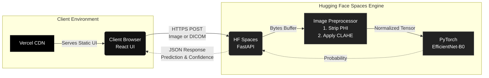
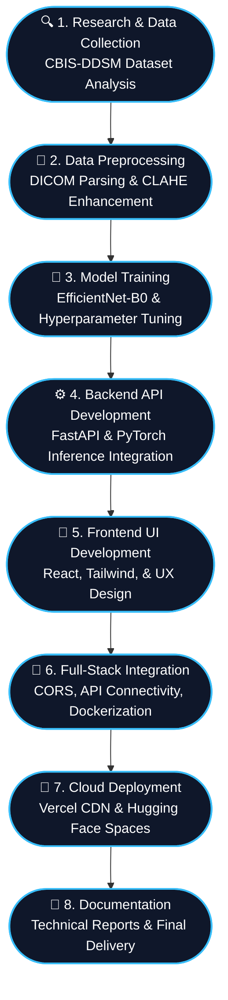

<div align="center">

# 🩺 FAHM Mammogram Classifier

**AI-Powered Binary Classification of Mammogram Images (Malignant vs. Benign/Normal)**

[](https://fahm-mammogram-classifier.vercel.app)
[](https://adeel41-mammogram-classifier.hf.space/docs)
[](https://www.python.org/)
[](https://pytorch.org/)

This project is a secure, decoupled full-stack AI application that processes mammogram scans and outputs clinical predictions with confidence scores.

</div>

---

## 🏗️ System Architecture

The application separates concerns between a highly responsive React client and an isolated, containerized Deep Learning inference engine, ensuring maximum performance, zero UI-blocking, and strict data security.



## 🔄 Project Workflow Phases

The development of this system followed a rigorous end-to-end Machine Learning lifecycle:



---

## 🚀 Quick Start (Local Development)

### Prerequisites
- **Docker + Docker Compose**
- **Python 3.11+** (for local model training)
- **Node.js 18+** (for frontend development)

### Run with Docker Compose
The entire stack can be spun up locally using containers.

```bash
git clone https://github.com/adeelshah41/fahm-technical-assessment
cd fahm-technical-assessment

# Model weights are tracked via Git LFS, ensure they are pulled:
git lfs pull

# Start both frontend and backend services
docker-compose up --build
```
* **Frontend:** `http://localhost:5173`
* **Backend API Docs:** `http://localhost:8080/docs`

---

## 🧠 Model Training

To retrain the EfficientNet-B0 classifier from scratch:

```bash
cd model
pip install -r requirements_train.txt

# 1. Download CBIS-DDSM dataset from Kaggle
# 2. Place files in the model/data/ directory

python train.py      # Starts the PyTorch training loop
python evaluate.py   # Generates metrics and ROC curves in docs/
```

---

## 🔒 Privacy & Security Protocols

Medical imaging applications demand strict adherence to data protection laws (e.g., Saudi PDPL, HIPAA). This architecture guarantees compliance through:

- **Zero Persistence Processing:** Images are processed entirely in-memory using ephemeral byte streams. Nothing is written to disk or databases.
- **DICOM Anonymization:** Extracted pixel arrays are completely stripped of Protected Health Information (PHI) before hitting the inference engine.
- **Transport Security:** End-to-end TLS 1.2+ encryption (HTTPS) prevents packet interception.
- **Data Minimization:** No access logs contain payload contents.
