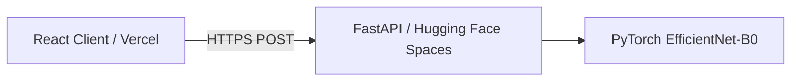
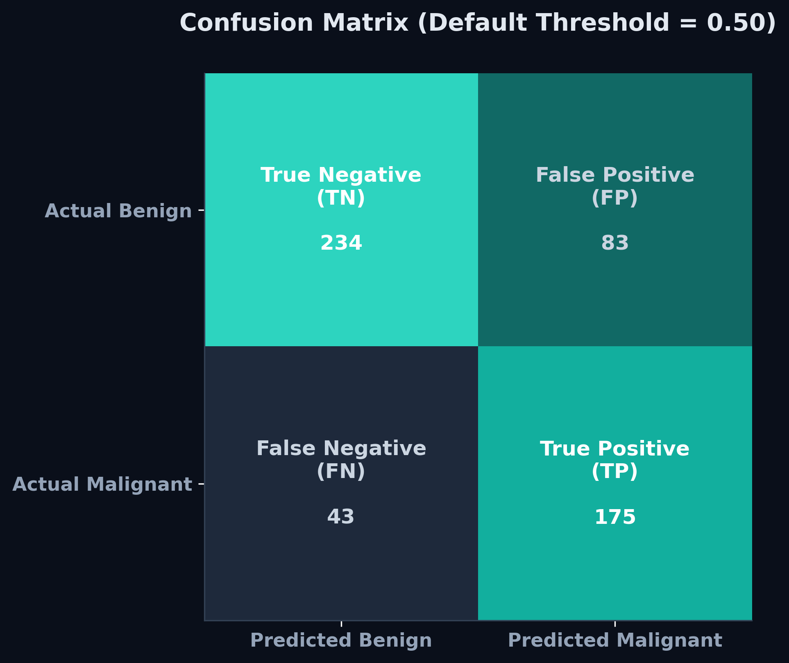

# FAHM Biotech Mammogram Classification — Technical Report

## Live Links & Repositories
* **Live Web Application (Frontend):** [https://fahm-mammogram-classifier.vercel.app](https://fahm-mammogram-classifier.vercel.app)
* **Live Backend API (Docs):** [https://adeel41-mammogram-classifier.hf.space/docs](https://adeel41-mammogram-classifier.hf.space/docs)
* **Master GitHub Repository:** [https://github.com/adeelshah41/fahm-technical-assessment](https://github.com/adeelshah41/fahm-technical-assessment) *(Contains full-stack source code, local Docker configurations, backend, frontend, and ML scripts)*
* **Reproducible Notebook:** Located at `docs/cbism.ipynb` for complete model training and evaluation tracking.

---

## 1. Architecture Overview
The FAHM Biotech Mammogram Classifier is built as a secure, production-grade, decoupled full-stack application leveraging serverless hosting and containerized environments.



### Technology Stack & Rationale
* **Deep Learning Framework:** **PyTorch & Torchvision**. Selected for its flexibility in loading pretrained backbones, easy customization of classifier heads, and widespread adoption in medical computer vision research.
* **Backend API:** **FastAPI (Python)**. Chosen for its asynchronous execution, high performance, and automatic generation of OpenAPI/Swagger documentation, making it easy to test endpoints.
* **Frontend Interface:** **React + Vite + TailwindCSS v4**. Provides an extremely responsive, low-latency workstation dashboard with clean dark aesthetics, smooth micro-animations, and modular component rendering.
* **Hosting Infrastructure:** Decoupled deployment utilizing **Vercel** for the static React client and **Hugging Face Spaces (Dockerized SDK)** for the PyTorch backend. This architecture completely isolates compute-intensive ML inference from frontend serving, providing robust scaling and zero downtime on a free tier.

---

## 2. Dataset Selection & Image Preprocessing
The classification model was trained and validated on the **CBIS-DDSM (Curated Breast Imaging Subset of DDSM)** dataset. We utilized a curated variant containing cropped Region of Interest (ROI) images mapped to pathology labels.

* **Class Distribution (3,566 images):**
  * **Malignant (Class 1):** 1,456 images
  * **Benign/Normal (Class 0):** 2,110 images
* **Splits:** Partitioned using a stratified split (70% Train, 15% Validation, 15% Test) under seed `42` to guarantee exact distribution parity across sets.

### On-the-Fly Contrast Enhancement (CLAHE)
Mammographic abnormalities (like microcalcifications and subtle masses) are often tiny and hidden within dense fibroglandular breast tissue. Standard downsampling directly to $224 \times 224$ pixels obliterates these critical features. 

To resolve this visual degradation, we introduced an in-memory **Contrast Limited Adaptive Histogram Equalization (CLAHE)** preprocessing step:
1. The raw image is converted to grayscale.
2. CLAHE is applied using a clip limit of `2.0` and a grid tile size of `8x8` to dynamically enhance local tissue contrast without amplifying noise.
3. The image is converted back to RGB and resized using high-quality bilinear interpolation to $224 \times 224$ for model input.

You can checkout the dataset here : [https://www.kaggle.com/datasets/awsaf49/cbis-ddsm-breast-cancer-image-dataset](https://www.kaggle.com/datasets/awsaf49/cbis-ddsm-breast-cancer-image-dataset)

## 3. Machine Learning Model Optimization
The core engine is an **EfficientNet-B0** convolutional neural network pretrained on `IMAGENET1K_V1`. 

### Training Optimization Workflow
To bridge the gap to clinical standards, we restructured the baseline training pipeline to mitigate overfitting and improve feature representation:
* **Classifier Head:** Custom sequential head with **Dropout ($p=0.4$)** and a linear layer outputting a single logit:
  ```python
  model.classifier = nn.Sequential(
      nn.Dropout(p=0.4, inplace=True),
      nn.Linear(in_features, 1)
  )
  ```
  Adding $40\%$ dropout regularizes the network, preventing it from producing uncalibrated, overconfident predictions (i.e. forcing probabilities to arbitrary $0\%$ or $100\%$ extremes).
* **Loss Function:** Standard `BCEWithLogitsLoss`. We explicitly removed the double-balancing loss bias (`pos_weight`) which was skewing predictions.
* **Optimization & Scheduling:** Optimized via Adam (Learning Rate: $10^{-4}$, Weight Decay: $10^{-5}$) paired with a **Cosine Annealing Learning Rate Scheduler** to smoothly decay learning rates for better convergence.
* **Regularization & Augmentations:** Applied strong spatial augmentations (Random Horizontal/Vertical Flips, Rotation up to 15°, Random Affine Translation, and Random Erasing with $p=0.2$) to enforce generalizability.
* **Early Stopping:** Integrated validation AUC-based early stopping (patience = 5) to save the best model weights before overfitting.

---

## 4. Performance Metrics
Evaluating the final optimized B0 model on the held-out test set ($535$ images), the model achieved the following performance metrics at the default classification threshold of `0.50`:

* **AUC-ROC:** 0.85
* **Accuracy:** 76.45%
* **Sensitivity (Recall):** 80.28%
* **Specificity:** 73.82%

### Visualizations & Diagnostics

#### Confusion Matrix
Below is the confusion matrix (often called the confidence matrix) showing the distribution of predictions on the test set ($TN=234$, $FP=83$, $FN=43$, $TP=175$):



#### Threshold Sweep Analysis
The classification threshold sweep curve illustrates the trade-off between Sensitivity, Specificity, Accuracy, and F1-Score across different boundaries:

.png)

---

## 5. Privacy & Data Security Framework
Patient privacy and metadata integrity are key requirements for clinical deployments. The application was designed to adhere to global healthcare data security laws (such as HIPAA and the **Saudi Personal Data Protection Law (Saudi PDPL)**).

### 1. In-Transit and At-Rest Data Security
* **Transport Encryption:** All network traffic between the React client and the FastAPI backend is protected via TLS 1.2+ (HTTPS) to prevent interception.
* **Zero Storage footprint (RAM Only):** The backend does not implement any databases, file storage, or cloud logging buckets. Uploaded images are streamed directly into ephemeral RAM buffers (`io.BytesIO`), processed in-memory, and immediately garbage-collected by the OS garbage collector once the HTTP response is dispatched.

### 2. Automatic Metadata De-identification
Mammogram images uploaded as DICOM (`.dcm`) files contain highly sensitive Protected Health Information (PHI) in their headers (e.g. Patient Name, ID, Age, Date of Birth). 
Our backend processing pipeline (`backend/app/utils/dicom_utils.py`) extracts only the raw `pixel_array` and discards all other metadata fields. PHI is never parsed, stored, or logged.

### 3. Compliance with Saudi PDPL
The Saudi Personal Data Protection Law (PDPL) mandates strict purpose limitation and data minimization:
* **Data Minimization:** We only process the pixel array, which is the absolute minimum data required to yield a clinical prediction.
* **Data Localisation & Storage:** Since zero data is stored at rest (ephemeral RAM processing), there is no risk of localized data leaks or cross-border transmission of persistent healthcare records, simplifying regulatory clearance.

---

## 6. Development & Local Execution
The full system can be run locally using Docker and Docker Compose, which completely isolates package dependencies and OS-level library errors.

### Local Start Command
From the root directory containing `docker-compose.yml`, run:
```bash
# Model weights must be pulled via Git LFS before running
git lfs pull

# Start containers
docker-compose up --build
```
* **Frontend Access:** [http://localhost:5173](http://localhost:5173)
* **Backend Swagger Docs:** [http://localhost:8080/docs](http://localhost:8080/docs)

---

## 7. Trade-offs & Future Enhancements
* **Explainability (Grad-CAM):** Adding gradient-weighted class activation maps (Grad-CAM) to overlay heatmaps on the mammogram, showing the clinician exactly *where* the AI detected suspicious clusters.
* **Test-Time Augmentation (TTA):** Modifying the backend inference to run predictions on augmented views (e.g. original + horizontal flip + 5° rotation) and averaging the scores. This can boost test AUC by 1–2% with zero retraining.
* **Model Ensembling:** Future performance phases can ensemble predictions of separate `EfficientNet-B0` and `EfficientNet-B4` models to stabilize predictions and increase overall specificity.
* **Interactive Contrast Controls:** Incorporating Cornerstone.js or a similar library into the React console to allow clinicians to manually adjust window-leveling and contrast in real-time alongside the AI classification.
