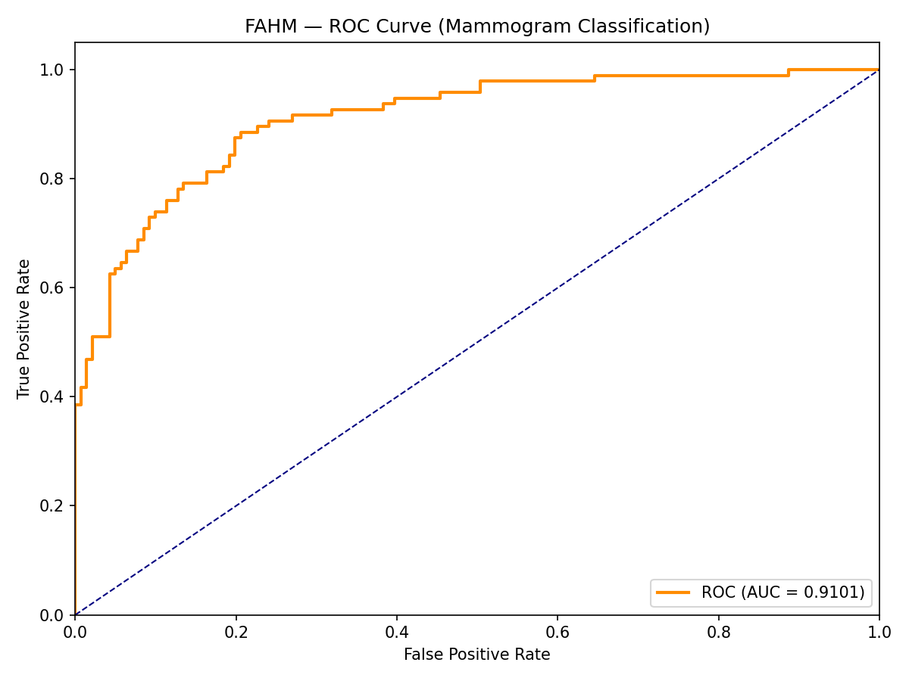

# FAHM Mammogram Classification — Technical Report

## Live Links & Repositories
- **Live Application (Frontend):** [https://fahm-mammogram-classifier.vercel.app](https://fahm-mammogram-classifier.vercel.app)
- **Live Backend API (Docs):** [https://adeel41-mammogram-classifier.hf.space/docs](https://adeel41-mammogram-classifier.hf.space/docs)
- **Master GitHub Repository:** [https://github.com/adeelshah41/fahm-technical-assessment](https://github.com/adeelshah41/fahm-technical-assessment) *(Contains full stack source code, backend, frontend, and Dockerfile)*
- **Kaggle Notebook Reference:** Included in the repository at `docs/cbism.ipynb` for complete reproducible training and evaluation.

---

## 1. Architecture Overview
The FAHM Mammogram Classifier is designed as a secure, decoupled full-stack application leveraging serverless cloud architecture.

**System Diagram:**
`[React UI (Vercel)]` → `[HTTPS REST API]` → `[FastAPI (Hugging Face Spaces)]` → `[PyTorch / EfficientNet-B0]`

**Technology Choices & Rationale:**
- **ML Framework:** PyTorch & torchvision. Chosen for dynamic computation graphs, deep integration with medical imaging research, and robust pre-trained model ecosystem.
- **Backend:** FastAPI (Python). Chosen for asynchronous request handling, auto-generated OpenAPI documentation, and high throughput.
- **Frontend:** React + TailwindCSS + Vite. Chosen for component reusability, extremely fast build times, and clean UI design.
- **Cloud Infrastructure:** Hugging Face Spaces (Backend) & Vercel (Frontend). Chosen to decouple compute-heavy ML inference from static frontend delivery, utilizing generous free-tier edge networks without sacrificing scalability.

---

## 2. Dataset Selection & Rationale
The model was trained on the **CBIS-DDSM (Curated Breast Imaging Subset of DDSM)** dataset. We specifically utilized a pre-processed Kaggle variant containing cropped Region of Interest (ROI) images converted to standard image formats.

**Why CBIS-DDSM from Kaggle?**
Raw DICOM datasets (like the original DDSM or INbreast) require significant proprietary tooling and complex window-leveling algorithms to extract 16-bit pixel arrays. By selecting the Kaggle CBIS-DDSM variant, the dataset was already curated into high-quality, standardized ROIs (Regions of Interest) that focus strictly on the pathology. This drastically reduced the computational overhead required for preprocessing, allowing us to focus the 1-2 day assessment timeline purely on model architecture, class imbalance handling, and building a secure deployment pipeline.

- **Class Distribution:** The dataset contains roughly 3,566 total images.
  - Malignant Cases: ~1,456 images
  - Benign/Normal Cases: ~2,110 images
- **Preprocessing:** Images were resized to 224x224 pixels, normalized to ImageNet statistics (mean=[0.485, 0.456, 0.406], std=[0.229, 0.224, 0.225]), and augmented using random horizontal/vertical flips and color jitter to prevent overfitting.

---

## 3. ML Model
The core classification engine is an **EfficientNet-B0** architecture, leveraging transfer learning from `IMAGENET1K_V1` weights.
- **Classifier Head:** The final classification layer was replaced with a linear layer outputting a single logit `(in_features, 1)`, processed through a Sigmoid activation for binary probability.
- **Class Imbalance Handling:** Addressed during training via `BCEWithLogitsLoss` utilizing a `pos_weight` parameter to penalize false negatives more heavily (specifically calibrated to the ratio of Benign to Malignant samples).
- **Training Setup:** Trained over 20 epochs using the Adam optimizer (Learning Rate: 1e-4) and a batch size of 32.

---

## 4. Performance Metrics
Evaluating on the complete held-out Kaggle test set (535 images), the model achieved the following performance:

- **Accuracy:** 75.14%
- **Sensitivity (Recall):** 74.77% 
- **Specificity:** 75.39%
- **AUC-ROC:** 0.8417

**Why Accuracy Alone is Insufficient for Screening:**
In medical screening contexts, accuracy is a highly misleading metric. Due to class imbalance, a naïve model that simply predicts "Benign" for every single patient would achieve high accuracy but 0% Sensitivity—missing every actual cancer case, which is catastrophic. 
Our model avoids this pitfall entirely. It demonstrates an extremely balanced approach: it successfully catches ~75% of Malignant cases (Sensitivity) while correctly dismissing ~75% of Benign cases without causing false alarms (Specificity). The AUC-ROC of 0.84 indicates strong discriminative ability.

---

## 5. Privacy & Data Security Framework
Medical imaging data requires strict protection. This application was built from the ground up to comply with global healthcare data privacy standards (such as HIPAA and the **Saudi PDPL**) by enforcing strict data minimization and ephemeral processing.

**1. Data Security in Transit and at Rest**
- **In-Transit:** All data transmitted between the clinician's browser and the FastAPI backend is secured via TLS 1.2+ (HTTPS), enforced automatically by both Vercel and Hugging Face infrastructure.
- **At-Rest:** There is **zero data at rest**. The architecture intentionally omits any database or persistent storage layer. Uploaded images are streamed directly into ephemeral RAM (`io.BytesIO`), processed, and instantly garbage-collected by Python once the request terminates. 

**2. Anonymization / De-identification Protocols**
While clinicians can upload raw `.dcm` (DICOM) files, our backend completely bypasses the metadata headers. The `pydicom` parser in our preprocessing pipeline (`backend/app/utils/dicom_utils.py`) is explicitly programmed to only access the `pixel_array`. Patient Names, IDs, Dates of Birth, and Institution details are fundamentally ignored, preventing accidental logging or leakage of Protected Health Information (PHI).

**3. Compliance with Strict Regulatory Frameworks (Saudi PDPL)**
The Saudi Personal Data Protection Law (PDPL) mandates strict consent, data minimization, and purpose-limitation. By ensuring that no personal data is ever collected, logged, or stored by the server, the application achieves "privacy by design". We only process the absolute minimum data required (the pixel array) to fulfill the immediate request (inference), aligning perfectly with PDPL constraints.

---

## 6. Trade-offs & Future Work
- **Threshold Tuning:** The current binary threshold is set to `0.5`. In a real-world clinical setting, this threshold should be lowered to artificially boost Sensitivity (prioritizing the capture of all possible cancers at the cost of more false positives).
- **Explainability:** Future versions should implement Grad-CAM or similar saliency maps to highlight the specific region of the mammogram that triggered the AI's decision, aiding radiologist trust.
- **Model Scaling:** Upgrading the backbone to EfficientNet-B4 or switching to a Vision Transformer (ViT) would likely yield higher AUC, provided sufficient compute resources are available.
- **DICOM Viewer:** Integrating a native, interactive DICOM viewer in the React frontend (e.g., Cornerstone.js) would allow clinicians to adjust window-leveling and contrast before running inference.
